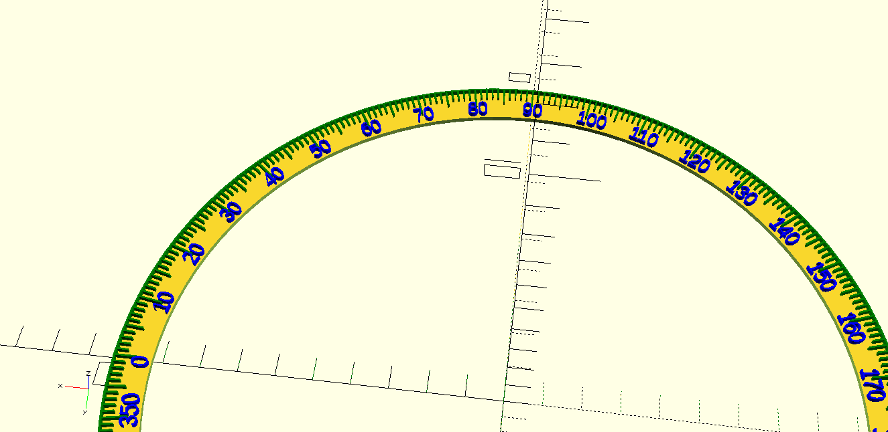
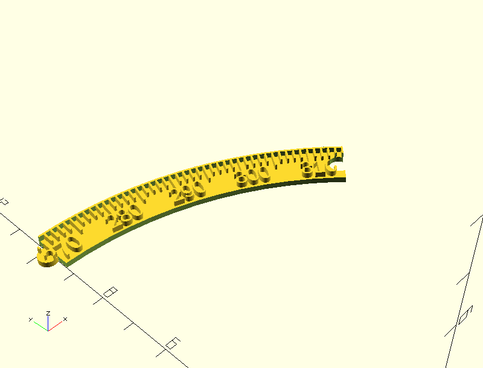

# 3D Printed Setting Circles

A setting circle is a round circle marked with degrees that is used for
aiming a telescope at a desired location. This repository has OpenSCAD
files for designing large round setting circles that are appropriate
for the base of a Dobsonian reflector. They could probably be modified to
make setting circles for other purposes, but I've never tried that.

The main code for designing the circle is in `setting_circle.scad` as a 
single OpenSCAD module. Since the entire circle is probably too large to
be printed in one piece, the file `sliced_setting_circle.scad` has a 
module for cutting the full circle into smaller pieces that are designed to
interlock similar to puzzle pieces to make the full object.

The 8 files `setting_circle[1-8].scad` use the sliced module to make the full
circle in 8 pieces that should be able to be printed on a "standard" 3D
printer. A circle about 20 inches in diameter will be cut into 8 pieces that
are under nine inches long.

## How to Use

Adjust the parameters at the start of `setting_circle.scad` to match your
desired size. The "native" unit in OpenSCAD is millimeters, so inch
measurements should be multiplied by 25.4 here. The code is not foll- nor
bullet-proof so you should uncomment the final line in that file so that it
generates output in OpenSCAD and tweak things until you are happy with the
result.

Then, open the eight `setting_circle_sliceN.scad` files, render them and export to
STL. There is a parameter in `sliced_setting_circle.scad` called `HALF_KERF` 
that will need to be set appropriately for your 3D printer so that the
interlocking pieces will fit snugly together. Expect to print and test as you
adjust that parameter.  Using the `sliced_setting_circle()` module, you should
be able to make little test pieces to get the fit right before printing the
entire thing.
